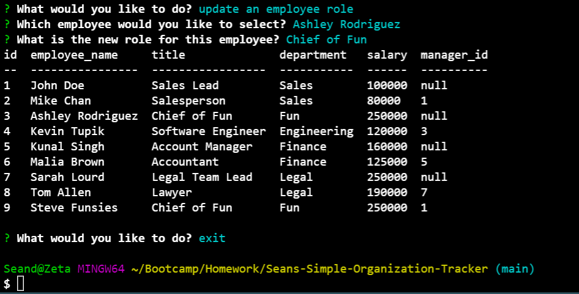

# Seans-Workforce-Tracker-v1

## Description
This terminal application is designed to allow organizations to host employee data for quick access.

## Usage
An organization can utilize this terminal application to create, store, and modify employee data. To start, source the schema.sql and the seeds.sql using mySQL2. Then, run app.js and follow the prompts in the terminal.

## Visual

## Contributions
Sean Duiser
sean.duiser.develop@gmail.com

## Deployed Link
https://drive.google.com/file/d/1ub1syBg4VVamfCwOF3gWkF3Vhq5Hzw_w/view